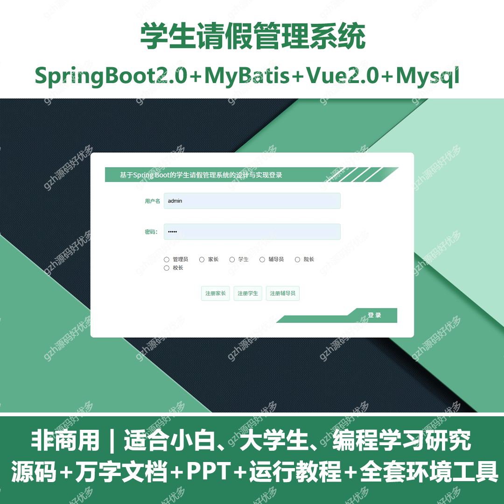
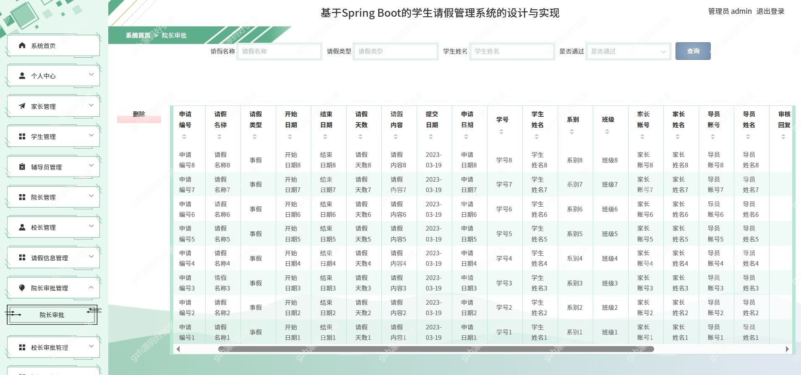
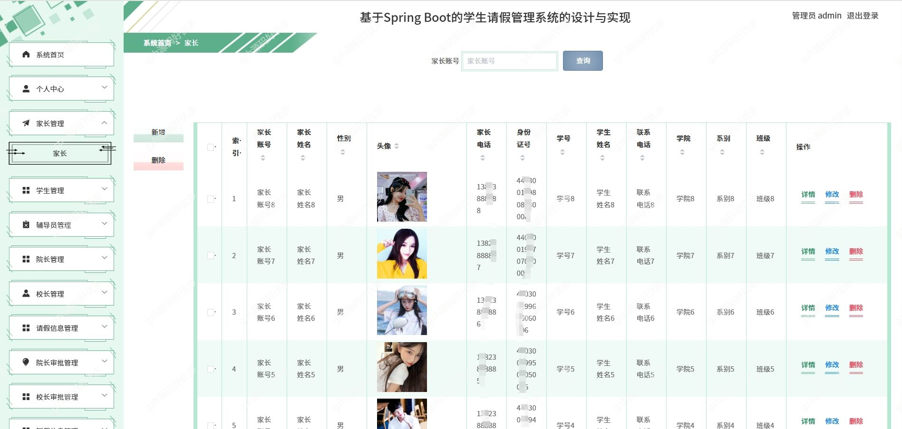
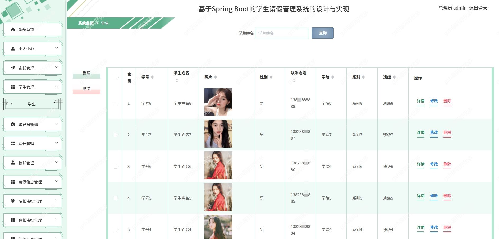
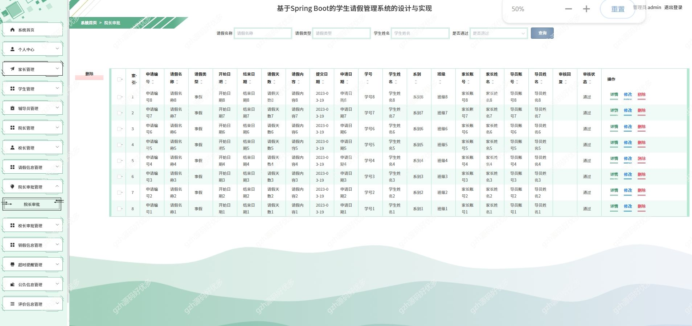
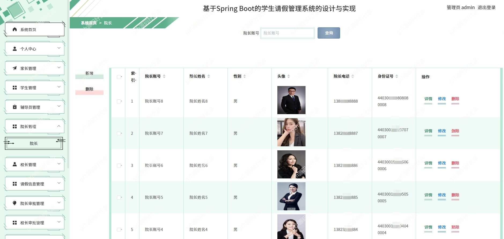
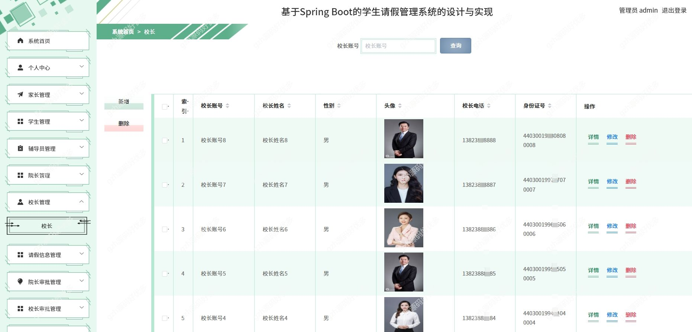
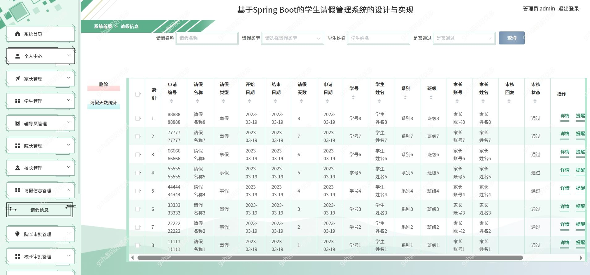

# springbootA332
springbootA332学生请假管理系统
 
## 查看主页获取源码

### 一、关键词
学生管理系统，学生请假管理系统

### 二、作品包含
源码+数据库+万字设计文档+PPT+全套环境和工具资源+本地部署教程

### 三、项目技术
前端技术：Html、Css、Js、Vue2.0、Element-ui 
后端技术：Java、SpringBoot2.0、MyBatis

### 四、运行环境（以下版本亲测，其他版本兼容性请自行测试）
开发工具：IDEA/eclipse  + VSCODE
数据库：MySQL5.7

数据库管理工具：Navicat10以上版本

环境配置软件： JDK1.8 + Maven3.6.3

前端Nodejs：14

浏览器：谷歌浏览器

### 五、项目介绍
项目编号：springbootA332

系统根据现有的管理模块进行开发和扩展，采用面向对象的开发的思想和结构化的开发方法对学生请假管理的现状进行系统调查

在学生请假管理系统实现了家长、学生、辅导员、院长、校长、请假信息、院长审批、校长审批等的功能性。

### 六、运行截图

